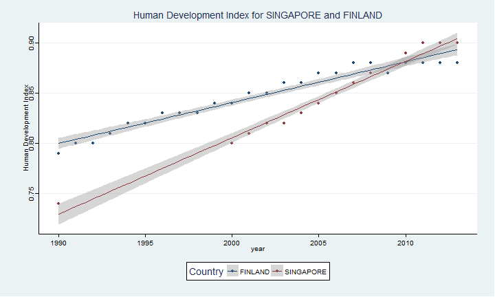
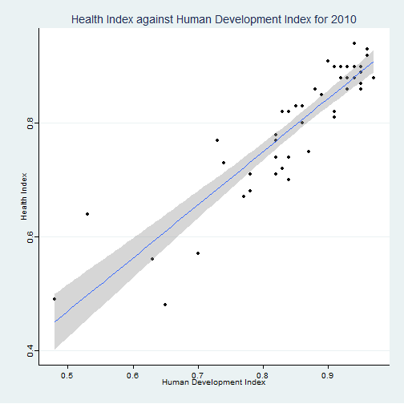

## <a href="https://erapryde.shinyapps.io/Pearson_Education_Indicators_Luo_Andy">Pearson Education Data</a> (1/5)

<br>
<br>
<div align="left"><font size="6">In this presentation, you may be directed to move <b>right</b> or <b>downwards</b>. </font></div> 

<div align="left"><font size="6">This app was produced to research 15 years of Educational inputs, outputs and socioeconomic factors. </font></div> 

<br>
<br>
<br>
<div align="left"><font size="10" color=#FFD700>Luo Kangshun, Andy</font></div> 
<div align="left"><font size="6" color=#ADFF2F>Educational Statistician </font></div> 


--- &vertical

## Education Trends tab (2/5)
<div align="left"><font size="6">In the <a href="https://erapryde.shinyapps.io/Pearson_Education_Indicators_Luo_Andy">App</a>,select an Education Indicator from the sidebar as well as Years of Interest in the Education tab. The description is loaded as well as the correlation with time. Press down to see what you can do.</font></div> 





***

## Education Trends tab (3/5)


.fragment Select the Education Indicator for comparison.

.fragment Select two countries for comparison.

.fragment Select the time-frame for comparison.

.fragment Examine the data at the sidebar.

.fragment Press right to continue.


---

## Snapshot Analysis (4/5)
<div align="left"><font size="6">Select a Year as well as another Indicator to correlate. Drag across groups of points and they display in the area below the chart.</font></div> 


```r
ggplot(data2,aes(y=value.y,x=value.x))+
        geom_point()+
        geom_smooth(method="lm")+
        xlab("Human Development Index")+
        ylab("Health Index")+
        theme_stata()+scale_colour_stata()+
        ggtitle("Health Index against Human Development Index for 2010")
```

 

---

## Education Data (5/5)

<div align="left"><font size="6">Select a Country and indicator and the table displays.</font></div> 


```r
data2
```

```
##         Country                   Index Year value
## 38226 SINGAPORE Human Development Index 1990  0.74
## 38227 SINGAPORE Human Development Index 1991    NA
## 38228 SINGAPORE Human Development Index 1992    NA
## 38229 SINGAPORE Human Development Index 1993    NA
## 38230 SINGAPORE Human Development Index 1994    NA
## 38231 SINGAPORE Human Development Index 1995    NA
## 38232 SINGAPORE Human Development Index 1996    NA
## 38233 SINGAPORE Human Development Index 1997    NA
## 38234 SINGAPORE Human Development Index 1998    NA
## 38235 SINGAPORE Human Development Index 1999    NA
## 38236 SINGAPORE Human Development Index 2000  0.80
## 38237 SINGAPORE Human Development Index 2001  0.81
## 38238 SINGAPORE Human Development Index 2002  0.82
## 38239 SINGAPORE Human Development Index 2003  0.82
## 38240 SINGAPORE Human Development Index 2004  0.83
## 38241 SINGAPORE Human Development Index 2005  0.84
## 38242 SINGAPORE Human Development Index 2006  0.85
## 38243 SINGAPORE Human Development Index 2007  0.86
## 38244 SINGAPORE Human Development Index 2008  0.87
## 38245 SINGAPORE Human Development Index 2009  0.87
## 38246 SINGAPORE Human Development Index 2010  0.89
## 38247 SINGAPORE Human Development Index 2011  0.90
## 38248 SINGAPORE Human Development Index 2012  0.90
## 38249 SINGAPORE Human Development Index 2013  0.90
## 38250 SINGAPORE Human Development Index 2014    NA
```
